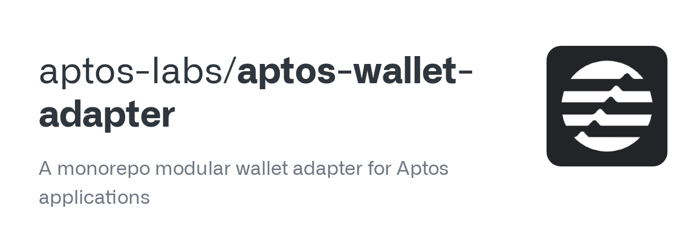
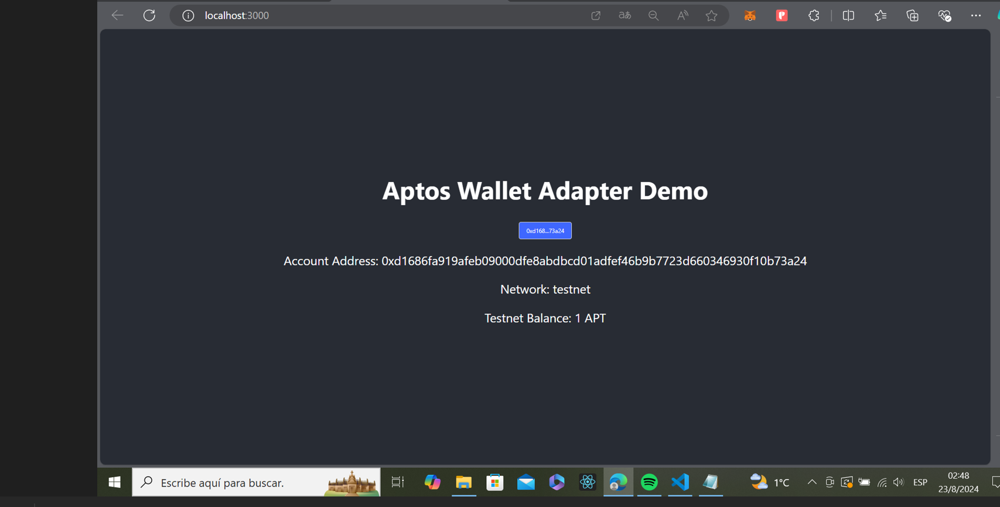

# Aptos Wallet Adapter

What is Aptos Wallet Adapter?

Aptos Wallet Adapter is a tool that allows developers to connect their decentralized applications (dApps) to various Aptos wallets. It provides a standardized way to interact with wallets, making it easier to manage user authentication and transactions.

## **Why is Wallet Connectivity Important in Web3?**

Wallet connectivity is a fundamental aspect of Web3 applications. Unlike traditional Web2 applications, which often rely on centralized authentication systems (like email and password), Web3 applications leverage blockchain technology for decentralized authentication and transaction management. Here are some 

reasons why wallet connectivity is crucial:

User Authentication: Wallets provide a secure and decentralized way to authenticate users that doesn’t rely on centralized servers.

Transaction Management: Wallets enable users to sign and submit transactions directly from their account, which is essential for interacting with blockchain networks as all actions require signed transactions.

Ownership and Control: Wallets give users full ownership and control over their digital assets.

## **The Aptos Wallet Adapter**

dApps often run through a browser extension or mobile application to read on-chain data and submit transactions. The Aptos Wallet Adapter allows for a single interface for apps and wallets to integrate together.

**Implementing wallet integration can be difficult for dApps in:**

Support and test all edge cases

Implement and maintain different wallet APIs

Provide users with needed functionality the wallet itself doesn’t support

Keep track on all the different wallets in our ecosystem

As such, the Aptos core development team created Aptos Wallet Adapter, which is an adapter that makes it easy for wallets to integrate with and for dApps to use and implement.

The Aptos Wallet Adapter acts as a service between dApps and wallets and exposes APIs for dApps to interact with the wallets by following a certain Wallet Standard. This in turns allows dApps to support many wallets with minimal integration efforts, and for wallets to follow a known standard and gain visibility.

